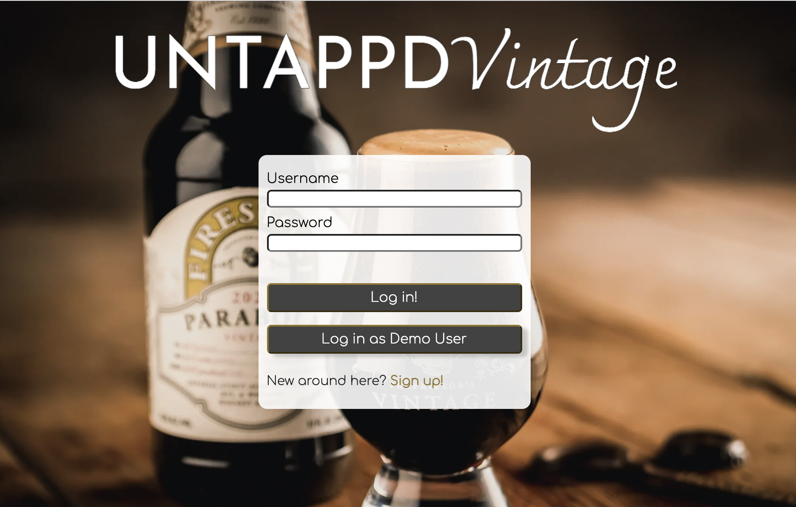
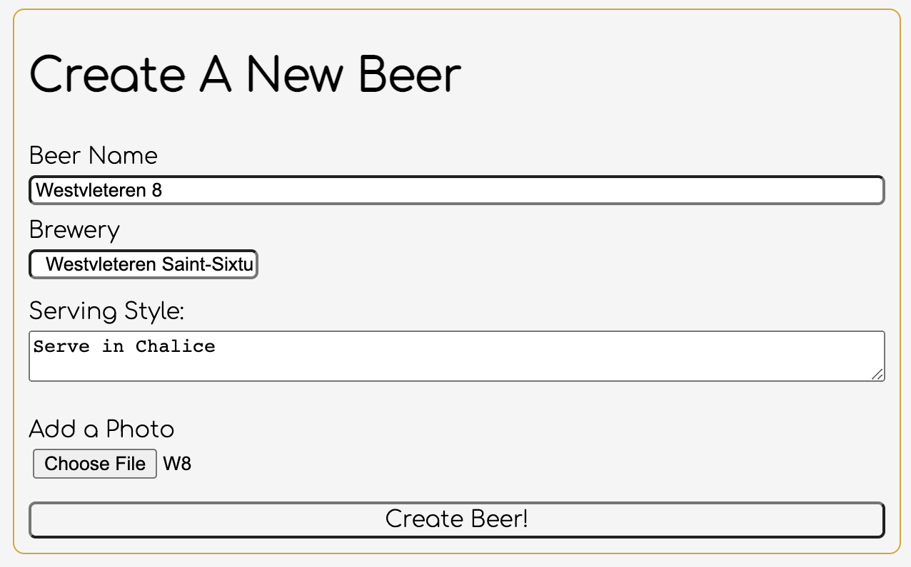

# UNTAPPDVintage

UNTAPPDVintage is a site for beer lovers to connect and exchange information about their experiances with aging beers.  Cant decide to enjoy something soon or celler it for a few years?  This is your information hub!  Share your thoughts and experiances (and pictures!), and look to see what other people have to say.

Curious about what people have to say? Take a look now at the [live site](https://untappd-vintage.herokuapp.com/#/)!

## Features

Anyone who wants to see the site is able to:
- view the reviews index page
- view the beers index page
- browse specific reviews and beers
- create an account, or log in with the demo-user account or an existing personal account

Logged-in users can:
-	create a new beer if they cannot find it in the site's database
-	update or delete beers that they created
-	create, update, or delete their own reviews

## Technologies

UNTAPPDVintage has a backend framework of Ruby on Rails, using a PostgreSQL database.  Its frontend is Javascript, react and redux.  SCSS was used for styling, and the image assets are stored and accessed on AWS S3.  

## Coming Soon!!  
-  Users can create Breweries with associated beers
-  A flavor profile table will be added to reviews so users can click flavors, and eventually search by flavor profiles
-  Beers will display their average rating as a whole, and the highest rated aged years.  
-  Reviews will include the age of the beer when the review was created
-  User profiles will be added, and connections to friends will be an extra feature

# Thanks for visiting.
